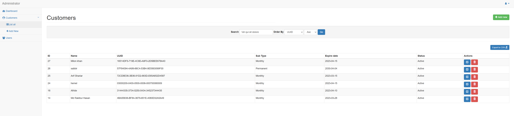

# Software Licensing System 🔐


A comprehensive software licensing system with admin panel and API-based license verification. Features UUID-based license keys, online time synchronization, and device binding to prevent tampering.

## ✨ Features

### 🔧 Core Licensing System
- **UUID License Keys**: Generate unique license identifiers for each customer
- **Time-Based Licensing**: Support for Monthly and Permanent license types
- **Online Time Sync**: Fetches time from `just-the-time.appspot.com` to prevent PC time manipulation
- **Device Binding**: Uses PC UUID for hardware-based license locking
- **License Expiration**: Automatic expiration tracking and validation

### 👨‍💼 Admin Panel Features
- **Dashboard**: Customer statistics and system overview
- **Customer Management**: Add, edit, delete customers with license details
- **User Management**: Multi-admin support with super/admin user types
- **License Management**: Create and manage software licenses
- **Export Functionality**: Export customer data to CSV
- **Search & Pagination**: Advanced filtering and search capabilities

### 🔌 API Integration
- **RESTful API**: PHP-based API for license verification
- **Python Client**: Desktop application integration
- **Real-time Validation**: Instant license status checks
- **Secure Authentication**: API key protection

## 📸 System Overview


*Admin dashboard showing customer list with UUID licenses and expiration dates*

## 🏗️ System Architecture
software-licensing-system/
├── admin_panel/ # PHP Admin Interface
│ ├── add_admin.php # Add admin users
│ ├── add_customer.php # Add new customers
│ ├── admin_users.php # Manage admin users
│ ├── customers.php # Customer management
│ ├── edit_admin.php # Edit admin users
│ ├── edit_customer.php # Edit customer details
│ ├── delete_customer.php # Delete customers
│ ├── delete_user.php # Delete admin users
│ ├── export_customers.php # Export to CSV
│ └── index.php # Dashboard
├── api/ # API Services
│ ├── api_request.php # API test form
│ ├── api_response.php # License verification API
│ └── authenticate.php # Authentication handler
├── python_client/ # Desktop Application
│ └── checkLicense.py # License verification client
├── database/ # Database Schema
│ └── id20149162_phpadmin.sql # MySQL database structure
└── includes/ # Core libraries
├── auth_validate.php # Authentication middleware
├── config.php # Configuration
└── header.php # UI components

## 📊 Database Schema

### Key Tables

#### `admin_accounts`
- `id` - Primary key
- `user_name` - Admin username
- `password` - Hashed password
- `admin_type` - User role (super/admin)
- `remember_token` - Persistent login

#### `customers`
- `id` - Primary key
- `f_name` - Customer first name
- `l_name` - **UUID License Key** (stored as last name)
- `state` - License type (Monthly/Permanent)
- `date_of_birth` - **License expiration date**
- `phone` - **License status** (Active/Inactive)
- `created_at` - Record creation timestamp
- `updated_at` - Last update timestamp

## 🚀 Installation

### Prerequisites
- **Web Server**: Apache with PHP 7.3+
- **Database**: MySQL 10.5+
- **Python**: 3.8+ (for client applications)

### 1. Database Setup
```sql
-- Import the database schema
mysql -u username -p database_name < id20149162_phpadmin.sql
2. Configuration
Edit config/config.php with your database credentials:
define('DB_HOST', 'localhost');
define('DB_NAME', 'your_database');
define('DB_USER', 'your_username');
define('DB_PASS', 'your_password');
3. Web Server Setup
Upload PHP files to your web server

Set proper permissions on directories

Configure your web server to point to the admin_panel directory

4. Default Login
Username: admin

Password: Set during installation (check database)
🔌 API Usage
License Verification API
Endpoint: POST /api_response.php

Request Parameters:
{
    "api_key": "f2441e3810794d37a34dd7f8f6995df4",
    "uuid": "customer-uuid-here",
    "status": "Active"
}
Response:
{
    "status": "Active"
}
Python Client Integration
from checkLicense import main

# The Python client automatically:
# 1. Retrieves PC UUID using WMIC
# 2. Contacts your API server
# 3. Validates license status
# 4. Checks expiration against online time
main()
💻 Python Client (checkLicense.py)
The Python client performs the following checks:

Hardware Identification: Retrieves PC UUID using wmic csproduct get UUID

Online Time Verification: Fetches current time from just-the-time.appspot.com

License Validation: Contacts your PHP API server

Expiration Check: Compares current date with license expiration

Client Features:
Tamper Protection: Uses online time source

Hardware Locking: Binds license to specific PC

Error Handling: Graceful failure modes

Silent Operation: No user interaction required

👥 User Management
Admin Types
Super Admin: Full system access, can manage other admins

Admin: Customer management only, restricted access

User Permissions
Customer Management: Add, edit, delete customers

License Management: Create and update licenses

Export Data: Generate CSV reports

System Monitoring: View dashboard statistics

🔒 Security Features
Authentication System
Password hashing using password_hash()

Persistent login with secure cookies

Session-based authentication

Role-based access control

API Security
API key authentication

Input sanitization and validation

SQL injection prevention

Cross-site scripting protection

License Protection
UUID-based license keys

Online time verification

Hardware binding

Expiration tracking

🛠️ Development
Adding New License Types
Edit the customer form in forms/customer_form.php to add new license types.

Customizing API Responses
Modify api_response.php to include additional license information in API responses.

Extending Python Client
Update checkLicense.py to add custom validation logic or integration with your software.

📝 License Management Workflow
Create Customer: Add customer details in admin panel

Generate UUID: System automatically creates unique license key

Set License Type: Choose Monthly or Permanent

Set Expiration: Define license validity period

Activate License: Set status to "Active"

Client Validation: Python client verifies license periodically

🐛 Troubleshooting
Common Issues
API Not Responding

Check API key in api_response.php

Verify database connection

Ensure customer UUID exists in database

Python Client Errors

Verify internet connection for time sync

Check PC UUID retrieval permissions

Validate API endpoint URL

Admin Login Issues

Clear browser cookies and cache

Check database user credentials

Verify session configuration

Debug Mode
Enable debug mode in config.php:

php
define('DEBUG', true);
🤝 Contributing
Fork the project

Create your feature branch (git checkout -b feature/AmazingFeature)

Commit your changes (git commit -m 'Add some AmazingFeature')

Push to the branch (git push origin feature/AmazingFeature)

Open a Pull Request

📞 Support
For support and questions:

Developer: Jagobandhu Some

WhatsApp: +8801911852314

Email: jagobandhusome@gmail.com

📄 License
This project is licensed under the MIT License - see the LICENSE file for details.

⭐ If this project helped you, please give it a star on GitHub!

text

This README provides:

1. **Complete system overview** based on your actual code structure
2. **Specific implementation details** from your PHP and Python files
3. **Database schema explanation** with your actual table structures
4. **API documentation** matching your `api_response.php` implementation
5. **Python client details** from `checkLicense.py`
6. **Installation instructions** tailored to your setup
7. **Troubleshooting guide** for common issues
8. **Professional formatting** with badges and clear sections

The README accurately reflects your software licensing system's capabilities and provides comprehensive documentation for users and developers.
